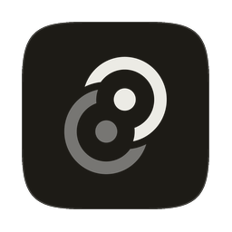
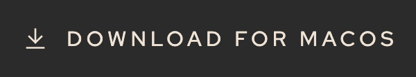
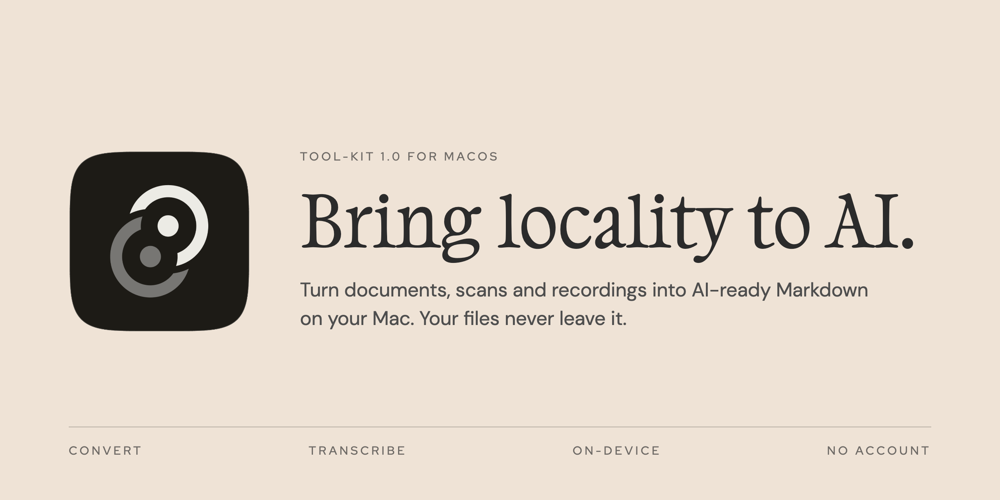
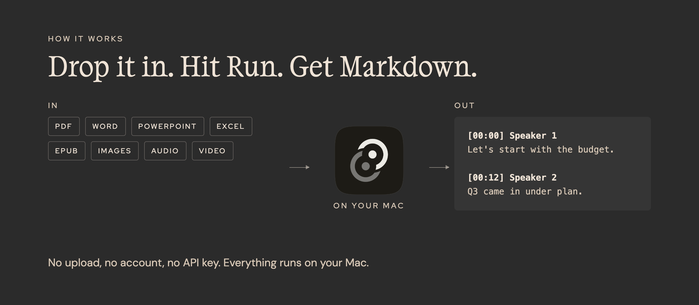

<p align="center">
  
</p>

<h1 align="center">Tool-Kit</h1>

<p align="center">
  <a href="https://github.com/tesfandiari1/tool-kit/releases/latest">
    <picture>
      <source media="(prefers-color-scheme: dark)" srcset="docs/media/download-dark.png">
      
    </picture>
  </a>
  <br>
  <sub>Apple silicon · macOS 26 or later · Free and open source</sub>
</p>

<br>



## Why local

Many AI workflows start by uploading your files to someone else's server.
Tool-Kit does that preparation on your Mac. It reads your PDFs, scans and
recordings with on-device engines and writes plain Markdown into a folder you
own. Then you decide what goes to an AI, and when.

No account. No API key. No upload. The app goes online only to download
Apple's speech model for the language you transcribe.



## What it does

| Drop | Get |
|---|---|
| **Documents.** PDF, Word, PowerPoint, Excel, EPUB, OpenDocument, RTF, CSV | Markdown |
| **Scans and images.** Scanned PDFs, PNG, JPEG, TIFF, WebP, GIF, BMP | Markdown, read by Apple's on-device text recognition |
| **Recordings.** WAV, M4A, MP3, FLAC, MP4, MOV | A Markdown transcript with timestamps and speaker labels |

- Tool-Kit picks the job from what you drop. Drop a whole folder, and the
  results keep its shape.
- Your originals stay where they are, and only the Markdown lands in your
  library. Settings can move dropped files into the library instead.
- Tool-Kit skips a file that already has a result.
- Your library is a plain folder of Markdown files. Read and edit them in the
  app, or open them in any editor.

## Install

1. Download the DMG from the
   [latest release](https://github.com/tesfandiari1/tool-kit/releases/latest).
2. Open the DMG and drag Tool-Kit to Applications.
3. Open Tool-Kit. macOS asks you once to confirm an app from the internet.
   Click **Open**.
4. Pick a folder for your library.

## Keys

| Keys | Action |
|---|---|
| <kbd>⌥</kbd><kbd>⌘</kbd><kbd>V</kbd> | Show or hide Tool-Kit from any app |
| <kbd>⌘</kbd><kbd>O</kbd> | Choose files to convert |
| <kbd>⌘</kbd><kbd>S</kbd> | Save the open document |
| <kbd>⌘</kbd><kbd>,</kbd> | Settings |
| <kbd>⌘</kbd><kbd>+</kbd> / <kbd>⌘</kbd><kbd>-</kbd> | Zoom |

In Settings, choose the transcription language and the number of speakers.
Add custom words to help the text recognition with names and jargon.

## Known limits

- Tool-Kit runs only on Apple silicon Macs with macOS 26 or later.
- Tool-Kit refuses HTML files and recordings that macOS cannot read, such as
  OGG, AAC, MKV, WebM and AVI.

---

## For developers

Everything below is for building Tool-Kit from source.

**Current work:** local same-machine closeout. Start at
[`docs/STATUS.md`](docs/STATUS.md).

### Current desktop implementation

| Job | Engine | In → Out |
|---|---|---|
| Convert | Local converter: pdf-inspector, AnyDoc, Vision OCR | PDF / DOCX / PPTX / XLSX / images / … → Markdown |
| Transcribe | Local worker (SpeechAnalyzer + FluidAudio) | audio / video → Markdown transcript |

Everything runs on the Mac. The app spawns the converter as a loopback sidecar,
and no file content leaves the machine. The job is chosen from what you drop.
Results land in the active project, and a dropped folder keeps its shape there.
A Settings toggle moves dropped files into the project instead of leaving them
in place.

## Develop

Requires Node 22.12+ (24 preferred), pnpm 11, and Rust 1.99. The repo pins
those in `.node-version`, `package.json`, and `rust-toolchain.toml`.

```bash
pnpm install
pnpm tauri dev     # first run compiles the Rust desktop crate, so it is slow
```

```bash
pnpm lint          # type-aware ESLint
pnpm build         # frontend only: tsc + vite build

cargo clippy --manifest-path apps/desktop/src-tauri/Cargo.toml --all-targets -- -D warnings
cargo clippy --manifest-path apps/converter/Cargo.toml --all-targets -- -D warnings
```

See [`docs/STATUS.md`](docs/STATUS.md) for session state and
[`CLAUDE.md`](CLAUDE.md) for desktop architecture and signing details. Weekly Dependabot keeps npm, both Cargo crates, and Actions
current; do not jump to TypeScript 7.

## Test

```bash
pnpm lint && pnpm build
cargo test --manifest-path apps/desktop/src-tauri/Cargo.toml --lib
cargo test --locked --manifest-path apps/converter/Cargo.toml
```

```bash
pnpm verify:deps     # cargo-deny, the RustSec advisory database and licenses
```

`apps/converter/tests/http_contract.rs` is the HTTP contract. CI runs all of the
above on every push and pull request.

## Release

macOS `app` + `dmg` only, Apple Silicon only, macOS 26 or later. Sign with a
Developer ID, and notarize if anyone else will download it.

```bash
# sign only; fine for a local install, locally-built apps are not quarantined
APPLE_SIGNING_IDENTITY="Developer ID Application: …" pnpm tauri build

# sign + notarize: additionally export APPLE_ID / APPLE_PASSWORD / APPLE_TEAM_ID
pnpm verify:release --notarized
```

Artifacts land in `apps/desktop/src-tauri/target/release/bundle/`. Signing credentials live
in `.env.local` (gitignored).

**`pnpm tauri build` notarizes the `.app` and not the DMG.** It staples the app
and merely signs the DMG, so a *downloaded* DMG is still refused by Gatekeeper
while a local install works. Finish it by hand:

```bash
xcrun notarytool submit <dmg> --apple-id … --password … --team-id … --wait
xcrun stapler staple <dmg>
```

Do not skip the verify step. A build with no signing identity still succeeds
and still produces a working `.app`, but it is ad-hoc signed: Gatekeeper on any
other Mac rejects it and notarization will not touch it. `verify-release.sh`
fails on exactly that, plus the team clause in the designated requirement, the
sidecar signatures, the Info.plist keys and the bundled licences. Add
`--notarized` to also check both stapled tickets and Gatekeeper.

## Conversion backend

The conversion service lives in [`apps/converter/`](apps/converter/). The app
spawns it on loopback, and it is the only service. See
[`docs/STATUS.md`](docs/STATUS.md).

- [`docs/STATUS.md`](docs/STATUS.md): state, critical path, milestones, traps, verify commands
- [`apps/converter/README.md`](apps/converter/README.md): backend setup and verification
- [`docs/archive/`](docs/archive/README.md): closed plans and verification evidence

## License

MIT. Red Hat Display and DM Sans are SIL OFL 1.1; TRJN DaVinci is licensed. See
[`apps/desktop/src/ui/fonts/THIRD_PARTY_NOTICES.md`](apps/desktop/src/ui/fonts/THIRD_PARTY_NOTICES.md).
The converter's runtime notices are in
[`apps/converter/THIRD_PARTY_NOTICES.md`](apps/converter/THIRD_PARTY_NOTICES.md).
